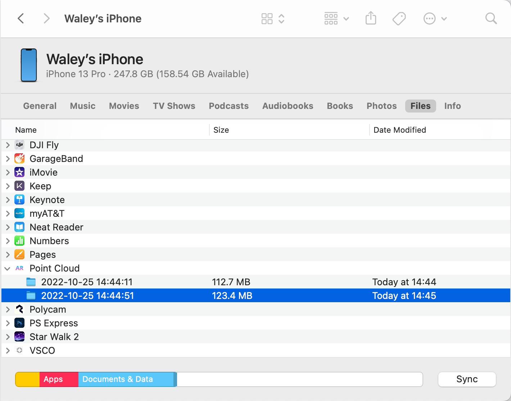
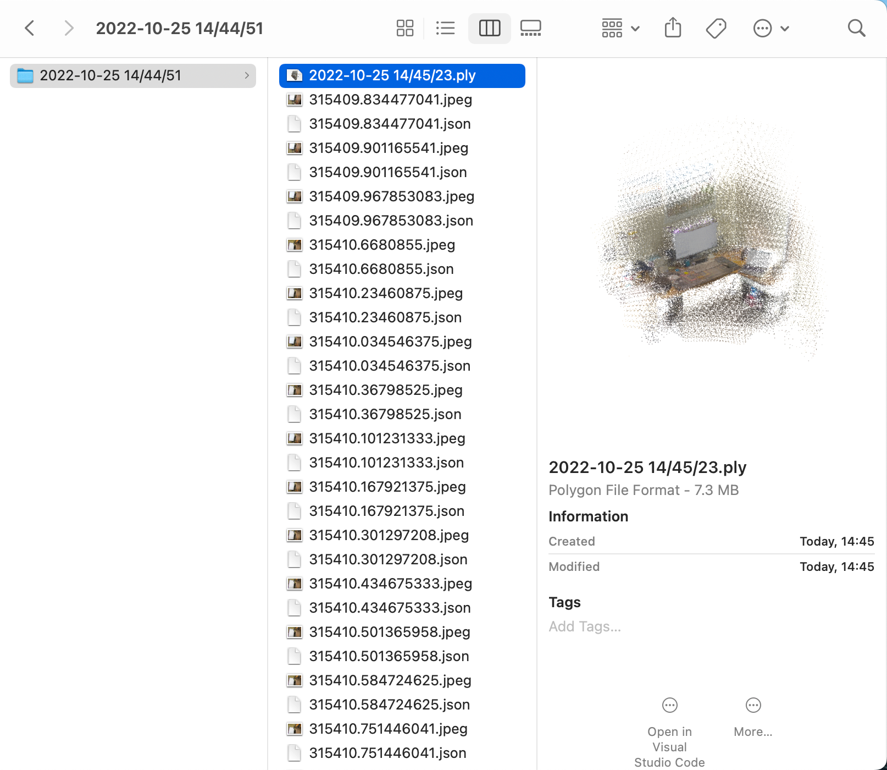
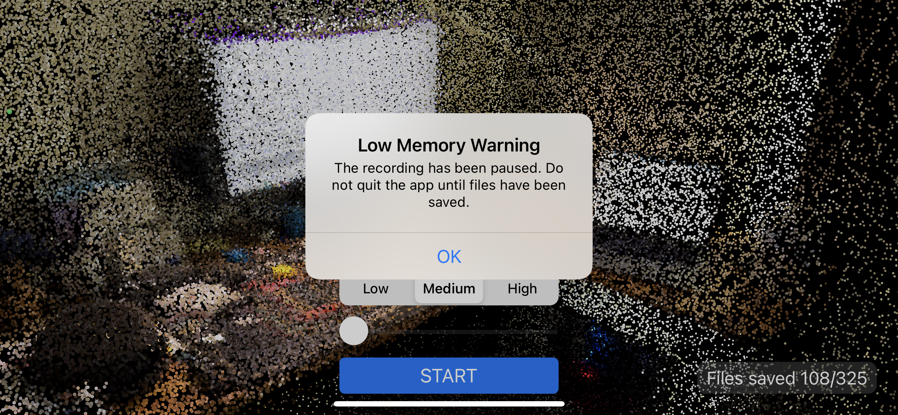

# Save iOS ARFrame and Point Cloud

This project improves the usability of the [sample code](https://developer.apple.com/documentation/arkit/environmental_analysis/displaying_a_point_cloud_using_scene_depth) from WWDC20 session [10611: Explore ARKit 4](https://developer.apple.com/wwdc20/10611/). Note that the sample code is also on the `original` branch and the original code from WWDC20 can be checked out at the first commit. The original project places points in the real-world using the scene's depth data to visualize the shape of the physical environment. 

## Usability functions

This project adds the following functions:

* Add buttons to start/pause recordings.

* Save [ARFrame](https://developer.apple.com/documentation/arkit/arframe) raw data asynchronously at each frame when recording. The selected data include
  ```swift
  // custom struct for pulling necessary data from arframes
  struct ARFrameDataPack {
      var timestamp: Double
      var cameraTransform: simd_float4x4
      var cameraEulerAngles: simd_float3
      var depthMap: CVPixelBuffer
      var smoothedDepthMap: CVPixelBuffer
      var confidenceMap: CVPixelBuffer
      var capturedImage: CVPixelBuffer
      var localToWorld: simd_float4x4
      var cameraIntrinsicsInversed: simd_float3x3
  }
  ```
  
  The captured images are stored in `jpeg` format and others are coded into `json` files. They can be retrieved in Finder with USB connection. Those raw data make it possible to leverage photogrammetry techniques for various tasks.

<p align="center">
  
</p>

* Save the point cloud in PLY format when the recording is stopped.

  <p align="center">
    
  </p>

* Add low memory warning and file saving progress.

  <p align="center">
    
  </p>

## Discussions

* [This answer](https://developer.apple.com/forums/thread/658109?answerId=643549022#643549022) has been very helpful in exporting point cloud in PLY format.

* According to [this answer](https://stackoverflow.com/a/51394204/15374210), releasing ARFrame memory pool holding is important. If `ARFrame currentFrame` is passed into time-consuming async tasks like converting data formats or saving files to disks, the memory pool used by ARFrame is retained and no more frames can be written to the pool. In this case, a warning will arise.

  ```
  ARSessionDelegate is retaining XX ARFrames.
  ```

  To solve this problem, copy over the selected data to custom struct and pass that to async tasks. To deep copy `CVPixelBuffer`, try [this code](https://gist.github.com/humblehacker/a55db40791605c4e40411f70bcd13d13).

* To get warning on low memory, see [this doc](https://developer.apple.com/documentation/xcode/responding-to-low-memory-warnings).

* Similar projects

  * [ryanphilly/IOS-PointCloud](https://github.com/ryanphilly/IOS-PointCloud)
  * [pjessesco/iPad-PLY-scanner](https://github.com/pjessesco/iPad-PLY-scanner)

  
